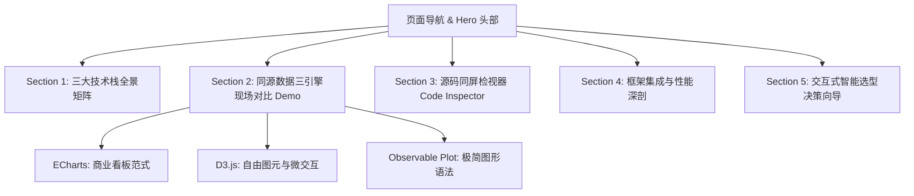

# 前端可视化技术栈展示与应用范例页面设计方案 (viz_tech)

在 `viz_tech/` 目录下构建一个高质量、现代且具备丰富交互体验的可视化技术栈全景对比与实战演练页面。该页面不仅系统呈现 **ECharts.js**、**D3.js** 与 **Observable Plot** 的理论与架构对比，更通过**同一份结构化数据集**，以三种不同范式现场渲染交互图表，并提供源代码同屏对比与交互式技术选型顾问。

---

## 需求理解与设计目标

1. **理论与架构沉淀**：
   - 完整收敛此前关于三大技术栈的核心定位、抽象层级（图表级 vs 图形基元级 vs 图形语法级）、优劣势、性能、渲染机制及现代框架（Vue/React）集成的技术剖析。
2. **同构实战范例（Live Showcase）**：
   - 使用**同一份综合多维数据集**（例如：科技行业研发投入、人均产出与增长率的多维指标数据），分别用 ECharts、D3.js 和 Observable Plot 实现对应的可视化组件。
   - 用户可以直观感受三者在默认视觉质感、Tooltip 交互、动效、图例控制上的风格差异。
3. **源码对照检查器（Code Inspector）**：
   - 针对上述同源图表，支持一键切换/联动查看三者的实现源码，直接对比代码风格与复杂度（配置对象驱动 vs 命令式 DOM 绑定 vs 声明式图层组合）。
4. **交互式选型决策工具（Interactive Decision Wizard）**：
   - 提供直观的交互式问答与场景模拟器（如勾选“研发周期紧”、“定制力导图”、“数据探索/科研统计”、“集成React”等），实时计算并给出推荐方案与架构组合建议。
5. **视觉设计与工程美学**：
   - 继承本项目已有成果（如 `viz_as_language`）的高品质排版规范，具备优雅的排版排版、深浅色模式适配、响应式网格与流畅交互。

---

## 页面架构与模块划分



### 模块详细规划：

#### 1. Header & Hero 视觉区
- **标题**：前端数据可视化技术全景与范式辨析 (*Visualization Stack Showdown*)
- **核心概览卡片**：
  - **Apache ECharts**：`图表级 (Chart-Level)` / `Canvas & SVG` / `开箱即用`
  - **D3.js**：`基元与算法级 (Primitive & Math)` / `原生 DOM / SVG` / `极致自由`
  - **Observable Plot**：`图形语法级 (Grammar of Graphics)` / `现代声明式` / `精炼高效`

#### 2. 全景对比矩阵 (The Comparison Matrix)
- 结构化表格展现：包含抽象层级、设计哲学、学习曲线、开发周期、定制上限、大数据承载极限（10万+点）、React/Vue 集成难度、社区中文资源等。
- 支持列高亮与维度筛选，快速定位关注点。

#### 3. 同源数据实时演练场 (Live Tri-Engine Showcase)
- **数据集设计**：构建一组包含国家/行业、研发投入占比、企业估值、年度增长率、员工规模的结构化数据（约 100~200 条样本，兼具连续变量、分类变量与时间趋势）。
- **三大引擎同场竞技**：
  - **ECharts 实例**：渲染高信息密度的商业气泡图/散点趋势，搭载 Toolbox、DataZoom 区域缩放滑块、原生平滑悬浮提示（Tooltip）与图例点击过滤。
  - **D3.js 实例**：利用 D3 原生 SVG、比例尺、弹性物理过渡动画（Transition）与画刷选择（Brush）联动高亮，展示对 DOM 图元与力导向/微交互的完全掌控。
  - **Observable Plot 实例**：利用 Plot 的 Mark 声明式图层（`Plot.dot`, `Plot.regressionY`, `Plot.text`）与色彩通道映射，展示 10~15 行代码完成高阶统计分布图的极致表现力。

#### 4. 源码对照检视器 (Code Inspector)
- 对应 Live Showcase 的同款图表，提供直观的 Tab 标签切换代码区。
- 附带核心指标比对：**代码行数 (LOC)**、**心智模型**、**样板代码占比**、**扩展难度**。

#### 5. 架构深剖：现代前端框架与渲染性能
- **DOM 控制权冲突与解法**：React/Vue Ref 模式、D3 作为纯数学计算层 + JSX 渲染、Observable Plot 纯函数 DOM 挂载模式。
- **性能选型分水岭**：Canvas (ECharts/ZRender) vs SVG (D3/Plot) vs WebGL (ECharts-GL/Deck.gl) 在 1k、10k、100k 点下的性能表现与权衡。

#### 6. 交互式选型决策向导 (Interactive Decision Wizard)
- 提供 5 个典型维度的选择项（如：交付时限、定制创新度、图表类型特征、团队技术栈分布、数据体量）。
- 实时计算得分，输出可视化雷达推荐图或百分比匹配结果，并附带最佳架构组合（如“ECharts 主体报表 + 局部 D3 拓扑图”）。

---

## 目录与文件设计

建议在 `viz_tech/` 下组织为结构清晰的静态项目结构：

```
viz_tech/
├── index.html        # 主页面骨架与结构化语义标记
├── style.css         # 现代美学样式（CSS 变量、响应式布局、语法高亮、交互卡片）
├── app.js            # 页面交互控制器（Tab 切换、决策向导逻辑、联动控制器）
├── lib/              # 本地离线第三方依赖库
│   ├── echarts.min.js
│   ├── d3.min.js
│   └── plot.umd.min.js
├── charts/
│   ├── data.js       # 统一的演示样本数据集
│   ├── echarts-demo.js  # ECharts 完整初始化与交互配置
│   ├── d3-demo.js       # D3.js 完整渲染管线（Scales, Axes, Marks, Transitions）
│   └── plot-demo.js     # Observable Plot 声明式图层与渲染
└── README.md         # 模块说明与快速预览指南
```

*(或者合并为 `viz_tech/index.html` + `viz_tech/style.css` + `viz_tech/script.js` 保持清晰与便携性)*

---

## 本地依赖管理 (Local Libs)

所有第三方核心库均下载至本地 `viz_tech/lib/` 目录中，确保页面完全支持离线打开与稳定运行，不依赖任何外部网络 CDN：

- `viz_tech/lib/echarts.min.js` (Apache ECharts 5.x 生产精简版)
- `viz_tech/lib/d3.min.js` (D3.js v7 生产精简版)
- `viz_tech/lib/plot.umd.min.js` (Observable Plot UMD 离线包，依赖本地全局 d3)

项目内通过相对路径 `<script src="lib/...">` 统一引入。

---

## 验证计划

### 1. 渲染与兼容性验证
- 确认三类库在本地浏览器中正常加载与初始化，控制台零报错。
- 验证 ECharts 的 Canvas 渲染、D3 的 SVG 图元层级、Observable Plot 的 DOM 返回机制。

### 2. 交互功能验证
- 测试 Live Showcase 中 ECharts 的缩放与 Tooltip、D3 的点击与过渡动效、Plot 的色彩图例。
- 测试 Code Inspector 的代码切换高亮与复制功能。
- 测试选型向导的题目选择、计分机制及动态方案输出。

### 3. 响应式与排版验证
- 适配不同屏幕分辨率（桌面大屏 1440px+，笔记本 1024px，平板与移动端流式适配）。
